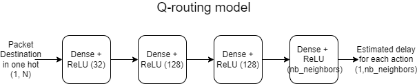
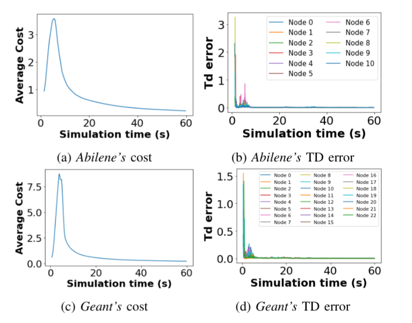
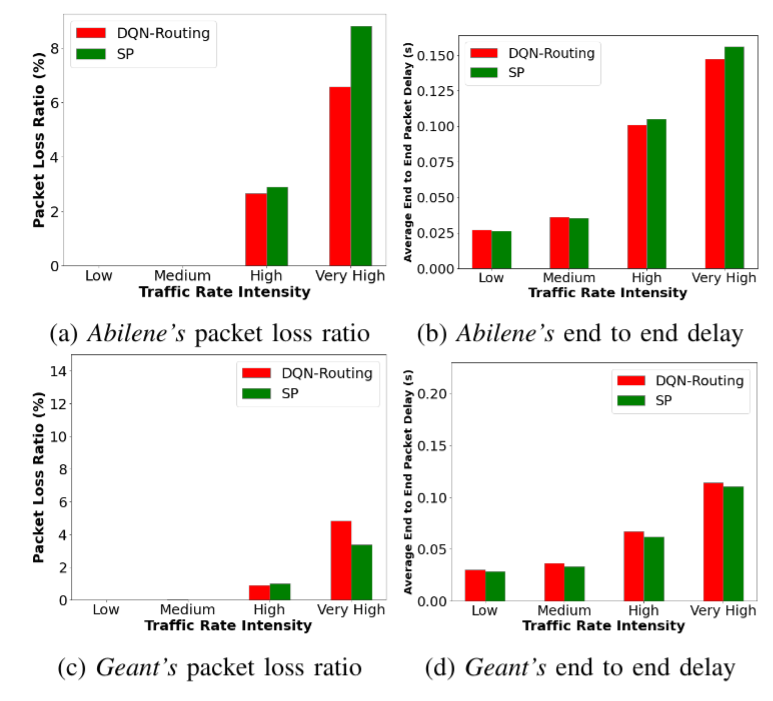

PRISMA: A Packet Routing Simulator for Multi-Agent Reinforcement Learning
============

PRISMA is a network simulation playground for developing and testing Multi-Agent Reinforcement Learning (MARL) solutions for dynamic packet routing (DPR). This framework is based on the OpenAI Gym toolkit and the ns-3 simulator.

The [OpenAI Gym](https://gym.openai.com/) is a toolkit for RL widely used in research. The network simulator [ns–3](https://www.nsnam.org/) is a standard library, which may provide useful simulation tools. It generates discrete events and provide several protocol implementations.

Moreover, the NetSim implementation is based on [ns3-gym](https://github.com/tkn-tub/ns3-gym), which integrates OpenAI Gym and ns-3.

The main contributions of this framework:
1) A RL framework designed for specifically the DPR problem, serving as a playground where the community can easily validate their own RL approaches and compare them.
2) A more realistic modelling based on: (i) the well-known ns-3 network simulator, and (ii) a multi-threaded implementation for each agent.
3) A modular code design, which allows a researcher to test their own RL algorithm for the DPR problem, without needing to work on the implementation of the environment.
4) Visual tools based on tensorboard allowing to track training and test phases.

Installation
============
This tool has been developed and tested under Linux Ubuntu 20.04 LTS (Focal Fossa).

1. We recommend you to clone the repository (to get the .git):
```
git clone https://github.com/rapariciopardo/PRISMA.git
```

2. If you don't have the ns3-gym alrady installed, you could initialize and update the ns3-gym submodule using the information in .git:
```
git submodule init
git submodule update
```

3. Run the script install.sh . It will install the ns-3 requirements (minimal requirements for C++, ZMQ and Protocol Buffers libs. For more information, see https://www.nsnam.org/wiki/Installation). Moreover, it will compile the messages.proto file for python. 

The usage of sudo may be required.
```
sudo sh install.sh
```

4. Go to my_network directory and install the python packages required using the command below (numpy, networkx, gym, tensorflow, zmq)
```
cd ./prisma/
pip install .
```

5. For training, run the script:
```
bash train.sh
```

6. For testing the agent, run the script:
```
bash test.sh
```

7. (Optional) For killing agents, use the script:
```
bash kill_agents.sh
```

Usage guide
===========

For training the agent, run the script train.sh. In order to test a model, run the script test.sh.  

In the script, you can change several parameters. The parameters are divided into 4 categories. The main parameters are the following:
## Global Simulation
```
simTime: Simulation time (in seconds).
basePort: Base TCP Port for agent communication. 
seed: Seed for simulation.
train: 1, if training; 0, Otherwise.
```
## Network
```
load_factor: Defines a factor multiplied by traffic rate matrix 
adjacency_matrix_path: Path for adjacency matrix
traffic_matrix_path: Path for traffic rate matrix
node_coordinates_path: Path for nodes coordinates matrix
max_out_buffer_size: maximum size of the output buffers
link_delay: Defines the delay of the link
packet_size: Defines the packet size.
link_cap: Defines the rate a packet is uploaded to the link.
```
## Agent
```
lr: Learning rate used for training
agent_type: "dqn", "dq_routing", "sp" (Shostest Path), "opt"
gamma: Discount factor $\gamma$. 
load_path: Path to load a model (optional)
training_trigger_type: "time" or "event". Defines what triggers training.
training_step: Defines the step in training in secs (if training_trigger_type is "time").
replay_buffer_max_size: Maximum replay buffer size.
```
## Session logging 
```
session_name: Name of the session
logs_parent_folder: Defines the parent folder where the togs will be stored.
```
## Others
```
start_tensorboard: If 1, it starts a tensorboard server 
tensorboard_port: Defines the tensorboard server port.
```


Agents
===========
The PRISMA framework provides 3 agents:

## DQN 

It implements the DQN (Deep Q-Network) agent. In this approach, a Neural Network is used in order to estimate the Q-value for a pair state-action. According to this approach, the input of the neural network (i.e., the observation space is composed by the packet's destination and the occupancy of the output buffers) 

## DQ-Routing

It implements the DQN agent for Q-Routing. In this approach, the observation space is composed by the packet's destination only. 


## SP

For using the Shortest Path algorithm, uncomment the block of lines in the launch_sp.sh file corresponding to this file.

Example
===========

We are going to illustrate Prisma usage with a pratical example. We will train a and develop a model for Q-Routing in two different topologies: Abilene and Geant. The Markov Decision Process (MDP) have the following formulation:

**Observation Space**: Packet's destination

**Action Space**: Output's interface

**Reward**: Delay to the next hop

**Done**: If a packet arrives its final destination

In the above example, the agent's policy aims to minimize the reward (delay). The agent's model is described in the figure below. We expect the agents learn to efficiently route the packets and its performance might be proximal to a Shortest Path algorithm.



The training curves are described below. The cost represents the average delay per packet which arrived to its final destination. The TD Error represents the model loss. We can observe that the model is capable of learning decreasing the loss over the training.



In the figure below, we can evaluate the model performance. We can observe that the DQN-Routing agent is capable of learning a ploicy proximal to a Shortest Path algorithm. In some of the scenarios evaluated, it can performs better than the shortest path algorithm.



Contact
============
* Redha A. Alliche, Université Côte d’Azur, CNRS, I3S,  alliche@i3s.unice.fr
* Ramon Aparicio-Pardo, Université Côte d’Azur, CNRS, I3S,  raparicio@i3s.unice.fr

How to reference PRISMA?
============
Please use the following bibtex :
```
@INPROCEEDINGS{Alli2206:PRISMA,
AUTHOR="Redha Abderrahmane Alliche and Tiago {Da Silva Barros} and Ramon
Aparicio-Pardo and Lucile Sassatelli",
TITLE="{PRISMA:} A Packet Routing Simulator for {Multi-Agent} Reinforcement
Learning",
BOOKTITLE="4th Intl Workshop on Network Intelligence collocated with IFIP Networking 2022",
ADDRESS="Catania, Italy",
DAYS=12,
MONTH=jun,
YEAR=2022,
}

```
