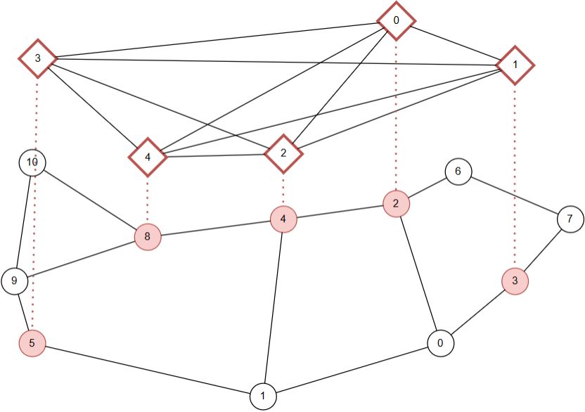
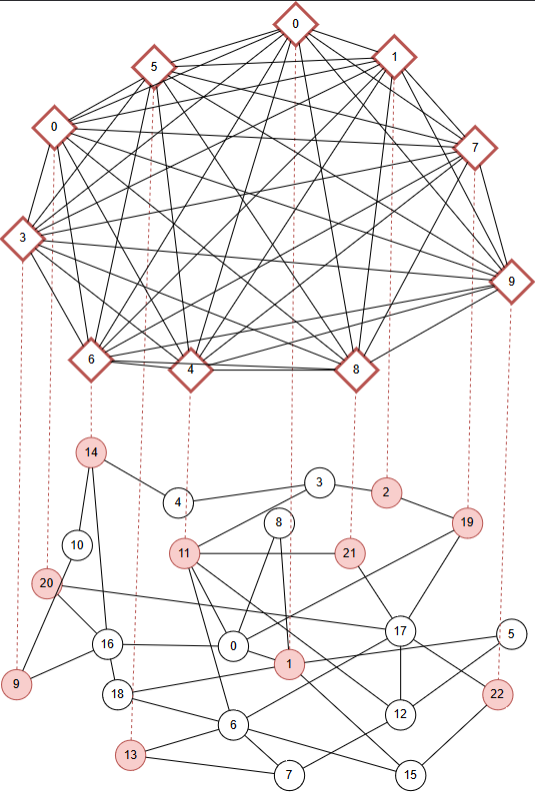

PRISMA-v2: A Packet Routing Simulator for Multi-Agent Reinforcement Learning - Extension to CLoud Overlay Networks
<<<<<<< HEAD
This branch gathers the code and the results of the paper "O-DQR: a Multi-Agent Deep Reinforcement Learning for Multihop Routing in Overlay Networks" (submitted to IEEE Transactions on Network and Service Management).
=======
>>>>>>> 7ba840121a9f88c99c702aa70bc103e7c4769b00
============

PRISMA-v2 is a network simulation playground for developing and testing Multi-Agent Reinforcement Learning (MARL) solutions for dynamic packet routing (DPR). This framework is based on the OpenAI Gym toolkit and the Ns3 simulator.

The [OpenAI Gym](https://gym.openai.com/) is a toolkit for RL widely used in research. The network simulator [ns–3](https://www.nsnam.org/) is a standard library, which may provide useful simulation tools. It generates discrete events and provide several protocol implementations.

Overlay networks are virtual networks built on top of a physical network (called underlay networks) utilizing network virtualization technology. Overlay networks provide flexible and dynamic traffic routing between nodes that are not directly connected by physical links, but rather by virtual links that correspond to paths in the underlying network.The PRISMA-v2 is the extension of PRISMA framework and allows the developing of MARL for DPR in overlay networks.

The main contributions of this framework:
1) Overlay topology simulation and control management.
2) Ability to add dynamic underlay traffic along with the overlay one.
3) High reproducibility of results by supplying containerizing capability using docker [Docker](https://www.docker.com/).
4) Refactoring the code for better readability.
5) Improve Tensorboard logging by incorporating both training and testing phases.
6) Implement control packets to realistically simulate the communication between the nodes and evaluate the overhead of running a DRL approach.

Installation
============
I- Local Installation
============

If you don't have the Nse-gym alrady installed

1. If the submodule was not yet initialized, initialize them.
```
git submodule init
git submodule update
```

2. Run the script install.sh . It will install the NS3 requirements (minimal requirements for C++, ZMQ and Protocol Buffers libs. For more information, see https://www.nsnam.org/wiki/Installation). Moreover, it will compile the messages.proto file for python. 

The usage of sudo may be required.
```
sudo sh install.sh
```

3. Go to my_network directory and install the python packages required using the command below (numpy, networkx, gym, tensorflow, zmq)
```
cd ./prisma/
pip install -e .
```

4. For training or testing, run the main program with the parameters:
```
python3 main.py $PARAMS
```
II- Using Docker
============
## 1. Build the docker image locally

a) Install docker dependencies

b) build the docker image using the docker file
```
docker build -t prisma .
```
c) run the docker image and bind only the examples folder to the container
```
<<<<<<< HEAD
sudo docker run --rm --gpus all -v ./prisma/examples:/app/prisma/examples -w /app/prisma prisma /bin/bash -c "python3 main.py $PARAMS"
=======
sudo docker run --rm --gpus all -v $(pwd)/prisma/examples:/app/prisma/examples -w /app/prisma prisma /bin/bash -c "python3 main.py $PARAMS"
>>>>>>> 7ba840121a9f88c99c702aa70bc103e7c4769b00
```
## 2. Use an existing environment from DockerHub
a) Pull the docker image from dockerhub
```
docker pull allicheredha/prisma_env
```
b) run the docker image and bind the complete folder to the container
```
<<<<<<< HEAD
sudo docker run --rm --gpus all -v ./prisma/:/prisma -w /prisma allicheredha/prisma_env /bin/bash -c "python3 main.py $PARAMS"
=======
sudo docker run --rm --gpus all -v $(pwd)/prisma:/app/prisma -w /app/prisma allicheredha/prisma_env /bin/bash -c "python3 main.py $PARAMS"
>>>>>>> 7ba840121a9f88c99c702aa70bc103e7c4769b00
```

Usage guide
===========

For training the agent, run the script train.sh. In order to test a model, run the script test.sh.  

In the script, you can change several parameters. The parameters are divided into 4 categories. The main parameters are the following:
## Global Simulation
```
numEpisodes: Number of episodes.
simTime: Simulation time (in seconds) of one episode.
basePort: Base TCP Port for agent communication. 
seed: Seed for simulation.
train: 1, if training; 0, Otherwise.
```
## Underlay Network
```
load_factor: Defines a factor multiplied by traffic rate matrix 
physical_adjacency_matrix_path: Path for adjacency matrix
traffic_matrix_path: Path for traffic rate matrix
<<<<<<< HEAD
node_coordinates_path: Path for nodes coordinates matrix
=======
>>>>>>> 7ba840121a9f88c99c702aa70bc103e7c4769b00
max_out_buffer_size: maximum size of the output buffers (in bytes)
link_delay: Defines the delay of the link
packet_size: Defines the packet size.
link_cap: Defines the rate a packet is uploaded to the link.
```
## Overlay Network
```
overlay_adjacency_matrix_path: Path for overlay adjacency matrix
map_overlay_path: Path for file which maps undelar and overlay node.
indexes
pingAsObs: If true, we use the tunnel delay info (recovered by the ping packets) as observation state.
pingPacketIntervalTime: The period between two ping packets (active when pingAsObs is true).

```
## Agent
```
lr: Learning rate used for training
agent_type: "dqn", "dq_routing", "sp" (Shostest Path), "opt" (oracle policy routing)
gamma: Discount factor $\gamma$. 
load_path: Path to load a model (optional)
training_step: Defines the step in training in secs.
replay_buffer_max_size: Maximum replay buffer size.
snapshot_interval: Defines the interval between two snapshots model saving.
```
## Session logging 
```
session_name: Name of the session
logs_parent_folder: Defines the parent folder where the togs will be stored.
```
## Others
```
start_tensorboard: If 1, it starts a tensorboard server 
tensorboard_port: Defines the tensorboard server port.
```


Agents
===========
The PRISMA framework provides 3 agents:

## DQN 

It implements the DQN (Deep Q-Network) agent. In this approach, a Neural Network is used in order to estimate the Q-value for a pair state-action. According to this approach, the input of the neural network (i.e., the observation space is composed by the packet's destination and the occupancy of the output buffers) 

## DQ-Routing

It implements the DQN agent for Q-Routing. In this approach, the observation space is composed by the packet's destination only. 


## SP

For using the Shortest Path algorithm.

## OPT
For using the oracle policy.

<<<<<<< HEAD
Experiments
===========
Those experiments are based on the paper untitled : "O-DQR: a Multi-Agent Deep Reinforcement Learning for Multihop Routing in Overlay Networks" (submitted to IEEE Transactions on Network and Service Management).
The experiments results along with the trained model, the tensorboard logs for the simulations and the scripts used for training, testing and plotting are available under the folder "experiments".

## 1. The objective of the study
We refer to O-DQR as logit sharing with guided reward.
The objective is to answer the following questions:
1) What is the performance of O-DQR compared to taking the direct overlay tunnel (the by-default ISP configuration) and to the Oracle routing policy?
2) What is the effect of having a guided reward penalty on the convergence of O-DQR compared to ignoring the packet loss or applying a predefined packet loss penalty?
3) How much overhead can we reduce, compared to model sharing, by using logit sharing and enabling the dynamic sending of replay memory packets?

## 2. Training
As explained in the paper, we train the agents on two overlay network topologies: 5 nodes on Abilene and 10 nodes on Geant. Those topologies are illustrated in the figure below.



The training matrices along with topology files are available under the folder "prisma/experiments/topologies/{topology_name}".
The evaluated agents are DQN with the following parameters:
```
lr: 0.00001
gamma: 1
training_step: 0.1
batch_size: 512
num_episodes: 20
duration of one episode: 20s
replay_buffer_max_size: 100000
training load factor: 0.9
lost packets treatment: [loss blind, fixed loss-penalty, guided reward]
lost packets penalty: ((31*packet_size)/link_cap + link_delay)*num_nodes (we consider the worst case in a buffer of size 30)
Communication strategies: [model sharing, logit sharing]
experience relevancy threshold ER_thr: [0, 0.25, 0.5, 0.75]
exploration strategy: epsilon-greedy from 1 to 0.01
target update period for model sharing U: [1, 3 , 5, 7, 10]
Tunnel delay estimation packets interval P: 0.1s
```
The training script is available in the file "experiments/scripts/train_test.py". Since the size of the files is large, we upload only the logs and the trained models for one topology (Abilene) and one traffic matrix (0).
The training logs are available under the folder "experiments/logs/{topology_name}/results/exps/logs". The trained models are available under the folder "experiments/models/{topology_name}/exps/saved_models".

## 3. Testing
The models are evaluated with same traffic matrix used for training, but with a different load factor ranging from 0.6 to 1.2 with a step of 0.1. The duration of a training session is 25s. The testing script is available in the file "experiments/scripts/train_test.py". The testing logs are available in the same tensorboard file as the training logs.

## 4. Plotting
We use the script "experiments/scripts/plot.py" to extract the results from the tensorboard logs and plot them. The extracted results can be found in the folder "experiments/results/{topology_name}/{training_name}/results".
We also evaluate the benchmark which are the shortest path policy (direct path) and oracle policy in the same settings.

## 4. Results
For the first question, we plot the performance of O-DQR compared to the direct path and the oracle policy. The results are shown in the figure below.


For the second question, we plot the performance of O-DQR with different lost packets treatment versus the episode number. The results are shown in the figure below.


For the third question, we plot the performance of O-DQR with different communication strategies versus the communication overhead. The results are shown in the figure below.


Also, we plot the performance of O-DQR with different experience relevancy threshold versus the episode number. The results are shown in the figure below.


## 5. Conclusion
The results show that O-DQR outperforms the direct path and the oracle policy. Moreover, the results show that the guided reward penalty is more efficient than the fixed loss penalty and the loss blind. Also, the results show that logit sharing is more efficient than model sharing. Finally, the results show that the experience relevancy threshold is an important parameter to tune in order to improve the performance of O-DQR.

TODO : 
- add the results logs and models
- add the extracted results
- push docker to dockerhub
=======
We are going to illustrate Prisma usage with a pratical example. We will train a and develop a model for Q-Routing in two different topologies: Abilene and Geant. The Markov Decision Process (MDP) have the following formulation:

**Observation Space**: Packet's destination and interfaces buffer lenth (or tunnels delay - for overlay networks)

**Action Space**: Output's interface

**Reward**: Delay to the next hop

**Done**: If a packet arrives its final destination

In the above example, the agent's policy aims to minimize the reward (delay). The agent's model is described in the figure below. We expect the agents learn to efficiently route the packets and its performance might be proximal to a Shortest Path algorithm.


The training curves are described below. The cost represents the average delay per packet which arrived to its final destination. The TD Error represents the model loss. We can observe that the model is capable of learning decreasing the loss over the training.


In the figure below, we can evaluate the model performance. We can observe that the DQN-Routing agent is capable of learning a ploicy proximal to a Shortest Path algorithm. In some of the scenarios evaluated, it can performs better than the shortest path algorithm.


>>>>>>> 7ba840121a9f88c99c702aa70bc103e7c4769b00
